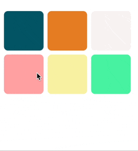

#  GridMovingView
### 사용자의 손가락 드래그를 통해 여러 뷰의 위치를 쉽게 변경할 수 있는 기능을 제공하는 Swift 프로젝트입니다.

  

 
## 주요 기능 및 사용된 기능
- **LongPressGesture**: 사용자가 화면을 길게 누르는 제스처를 감지합니다.
- **UILongPressGestureRecognizer.location**: 제스쳐가 발생한 곳의 위치를 파악합니다.
- **UIBezierPath**: 뷰의 테두리를 세련되게 디자인하는 데 사용됩니다.
- **DispatchQueue**: 비동기 처리를 위한 기능으로, UI 업데이트나 다른 작업을 위해 사용됩니다.
- **frame.intersects**: 두 프레임이 교차하는지 확인하는 기능으로, 뷰의 위치 변경 시 사용됩니다.

## 참고자료

[블로그 설명 바로가기](https://hhproject.me/entry/iOS-Swift-TagCalendar-%EC%BB%B4%ED%8F%AC%EB%84%8C%ED%8A%B8-3-%EB%B7%B0-%EC%9C%84%EC%B9%98-%EC%9D%B4%EB%8F%99-%EC%8B%9C-%ED%8A%B9%EC%A0%95-%EC%9C%84%EC%B9%98%EA%B7%B8%EB%A6%AC%EB%93%9C%EC%97%90%EB%A7%8C-%EC%9C%84%EC%B9%98%ED%95%98%EA%B2%8C-%ED%95%98%EA%B8%B0)
